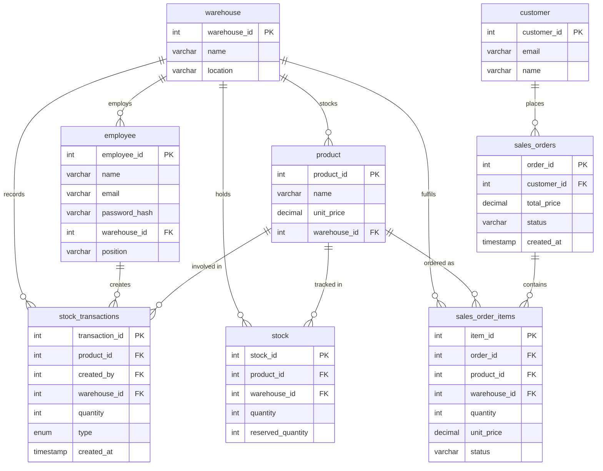

# Inventory Management System

A full-stack web application for managing multi-warehouse inventory, processing customer orders, and tracking stock movements — built with a RESTful Node.js/Express API, a MySQL relational database, and a React (Vite) frontend.

---

## Table of Contents

- [Overview](#overview)
- [Tech Stack](#tech-stack)
- [Architecture](#architecture)
- [Features](#features)
- [Database Schema](#database-schema)
- [API Reference](#api-reference)
- [Project Structure](#project-structure)
- [Getting Started](#getting-started)
- [Environment Variables](#environment-variables)

---

## Overview

The Inventory Management System supports two distinct user roles — **Employees** and **Customers** — each with their own authentication flow and set of capabilities. Employees manage warehouse stock and fulfill incoming orders; customers browse available products and place orders.

Key design goals:
- **Warehouse-scoped access control** — employees can only view and modify stock within their assigned warehouse, enforced both at the middleware and at the SQL query level.
- **Atomic order processing** — order creation and fulfillment use database transactions to prevent race conditions and stock inconsistencies.
- **Intelligent order routing** — customer orders are automatically routed to the warehouse holding the highest available stock for each requested product.
- **Security-first API** — JWT authentication with token blacklisting on logout, bcrypt password hashing, rate limiting on all auth endpoints, and strict CORS policy.

---

## Tech Stack

| Layer      | Technology                                              |
|------------|---------------------------------------------------------|
| Frontend   | React 19, React Router v7, Vite 7, Axios                |
| Backend    | Node.js, Express 5, ES Modules                          |
| Database   | MySQL (mysql2 with connection pooling)                  |
| Auth       | JSON Web Tokens (jsonwebtoken), bcryptjs                |
| Security   | express-rate-limit, CORS (origin whitelist), dotenv     |
| Dev Tools  | nodemon, ESLint                                         |

---

## Backend Architecture

| Layer | Responsibility |
|---|---|
| **routes/** | Wires URL paths to controller functions; applies per-route middleware |
| **middleware/** | `auth.js` — JWT verification & role guard; `rateLimit.js` — IP-based throttling & in-memory JWT blacklist |
| **controllers/** | One file per resource domain (auth, orders, products, stock, warehouse); owns request/response cycle |
| **services/** | `orderService.js` — pure functions shared between controllers (e.g. `deriveOrderStatus`) |
| **db.js** | Exports a single `mysql2/promise` connection pool used by all controllers |

---

## Features

### Employee Portal
- **Registration & Login** — secure account creation with bcrypt-hashed passwords; JWT issued on login.
- **Warehouse Dashboard** — real-time view of all stock levels (available vs. reserved) in the employee's assigned warehouse.
- **Stock Adjustment** — add (IN) or remove (OUT) stock with validation that prevents removing units below the reserved threshold.
- **Transaction History** — full audit trail of all IN/OUT stock movements, including who made each change.
- **Order Fulfillment Queue** — view all pending orders assigned to the warehouse and individually fulfill or reject each line item.
  - **Fulfill**: atomically decrements both `quantity` and `reserved_quantity`.
  - **Reject**: releases the reservation (`reserved_quantity` only), leaving physical stock untouched.

### Customer Portal
- **Product Catalog** — browse all products with real-time available quantity (aggregated across all warehouses, deduplicated by name/price).
- **Shopping Cart** — add items, adjust quantities, and proceed to checkout.
- **Checkout & Order Placement** — intelligent warehouse routing selects the best-stocked warehouse per product; stock is reserved atomically on placement.
- **Order History** — track all past orders with derived overall status (`PENDING`, `FULFILLED`, `REJECTED`, `PARTIALLY_FULFILLED`).

---

## Database Schema




---

## API Reference

### Auth (public)

| Method | Endpoint              | Description                        |
|--------|-----------------------|------------------------------------|
| POST   | `/api/register`       | Register a new employee            |
| POST   | `/api/login`          | Employee login — returns JWT       |
| POST   | `/api/customer-login` | Customer login — returns JWT       |
| POST   | `/api/logout`         | Revoke current JWT (blacklists jti)|

### Warehouses

| Method | Endpoint             | Auth     | Description                    |
|--------|----------------------|----------|--------------------------------|
| GET    | `/api/warehouses`    | Public   | List all warehouses            |
| GET    | `/api/warehouse/:id` | Employee | Get a single warehouse by ID   |

### Stock (employee only)

| Method | Endpoint                                | Description                          |
|--------|-----------------------------------------|--------------------------------------|
| GET    | `/api/stocks/:warehouseId`              | Get stock levels for a warehouse     |
| POST   | `/api/stocks/:warehouseId/adjust`       | Adjust stock (IN / OUT)              |
| GET    | `/api/stocks/:warehouseId/transactions` | Get stock transaction history        |

### Products (public)

| Method | Endpoint                     | Description                                              |
|--------|------------------------------|----------------------------------------------------------|
| GET    | `/api/products/available`    | List all in-stock products (aggregated across warehouses)|
| GET    | `/api/products/:productId`   | Get a single product with available quantity             |

### Orders — Customer

| Method | Endpoint                              | Description                          |
|--------|---------------------------------------|--------------------------------------|
| POST   | `/api/orders`                         | Place a new order                    |
| GET    | `/api/orders/:orderId`                | Get order details                    |
| GET    | `/api/customers/:customerId/orders`   | Get all orders for a customer        |

### Orders — Employee Actions

| Method | Endpoint                                     | Description                         |
|--------|----------------------------------------------|-------------------------------------|
| GET    | `/api/orders/warehouse/:warehouseId/pending` | List pending items for a warehouse  |
| PATCH  | `/api/orders/items/:itemId/fulfill`          | Fulfill an order item               |
| PATCH  | `/api/orders/items/:itemId/reject`           | Reject an order item                |

---


## Project Structure

```
inventory_management_system/
├── backend/
│   ├── server.js              # Express app entry point — mounts routes and global middleware
│   ├── db.js                  # MySQL connection pool (mysql2/promise)
│   ├── employee_gen.js        # Seed script — inserts 20 employees across 10 warehouses
│   ├── controllers/
│   │   ├── authController.js       # Register, login (employee & customer), logout
│   │   ├── orderController.js      # Place orders, fulfill/reject items, order queries
│   │   ├── productController.js    # Available products, single product lookup
│   │   ├── stockController.js      # Stock levels, adjustments, transaction history
│   │   └── warehouseController.js  # Warehouse listing and detail
│   ├── middleware/
│   │   ├── auth.js            # JWT verification middleware (employee & customer guards)
│   │   └── rateLimit.js       # express-rate-limit configuration for auth endpoints
│   ├── routes/
│   │   ├── auth.js            # POST /api/register, /api/login, /api/customer-login, /api/logout
│   │   ├── orders.js          # Order and order-item routes
│   │   ├── products.js        # Product routes
│   │   ├── stocks.js          # Stock routes
│   │   └── warehouses.js      # Warehouse routes
│   ├── services/
│   │   └── orderService.js    # Shared order-processing business logic (warehouse routing, reservations)
│   ├── .env                   # Environment variables (not committed)
│   └── package.json
│
├── database/
│   ├── alternate_schema.sql   # Full CREATE TABLE statements for all 7 tables
│   ├── customer_gen.sql       # Seed data — customers
│   ├── product_gen.sql        # Seed data — products
│   ├── stock_gen.sql          # Seed data — stock levels
│   └── warehouse_gen.sql      # Seed data — warehouses
│
└── frontend/
    ├── src/
    │   ├── App.jsx            # React Router route definitions
    │   ├── main.jsx           # React entry point
    │   ├── index.css          # Global styles
    │   ├── components/        # Shared/reusable React components
    │   ├── pages/
    │   │   ├── landing.jsx / landing.css           # Home / role selector
    │   │   ├── login.jsx / login.css               # Employee login
    │   │   ├── register.jsx / register.css         # Employee registration
    │   │   ├── dashboard.jsx / dashboard.css       # Employee dashboard (stock, orders, history)
    │   │   ├── customer-login.jsx                  # Customer login
    │   │   ├── customer-products.jsx / customer-products.css  # Product catalog with cart
    │   │   ├── checkout.jsx / checkout.css         # Order placement
    │   │   └── customer-orders.jsx / customer-orders.css     # Customer order history
    │   └── utils/
    │       └── auth.js        # JWT helpers: getToken, authHeaders, logout, handleUnauthorized
    ├── index.html
    └── package.json
```

---

## Getting Started

### Prerequisites

- Node.js >= 18
- MySQL >= 8.0

### 1. Database Setup

```bash
# Create the database and schema
mysql -u root -p < database/alternate_schema.sql

# Seed reference data
mysql -u root -p inventory_db < database/warehouse_gen.sql
mysql -u root -p inventory_db < database/customer_gen.sql
mysql -u root -p inventory_db < database/product_gen.sql
mysql -u root -p inventory_db < database/stock_gen.sql
```

### 2. Backend

```bash
cd backend
npm install

# Configure environment variables (see section below)
cp .env.example .env

# (Optional) Seed 20 employee accounts across 10 warehouses
node employee_gen.js

# Start the development server
node server.js
# or with hot-reload:
npx nodemon server.js
```

The API will be available at `http://localhost:8000`.

### 3. Frontend

```bash
cd frontend
npm install
npm run dev
```

The app will be available at `http://localhost:5173`.

---

## Environment Variables

Create `backend/.env` with the following keys:

```env
# Database
DB_HOST=localhost
DB_USER=your_db_user
DB_PASSWORD=your_db_password
DB_NAME=inventory_db

# JWT
JWT_SECRET=your_long_random_secret   # generate with: openssl rand -hex 64
JWT_EXPIRES_IN=7d

# CORS — set to your frontend origin
FRONTEND_URL=http://localhost:5173
```
